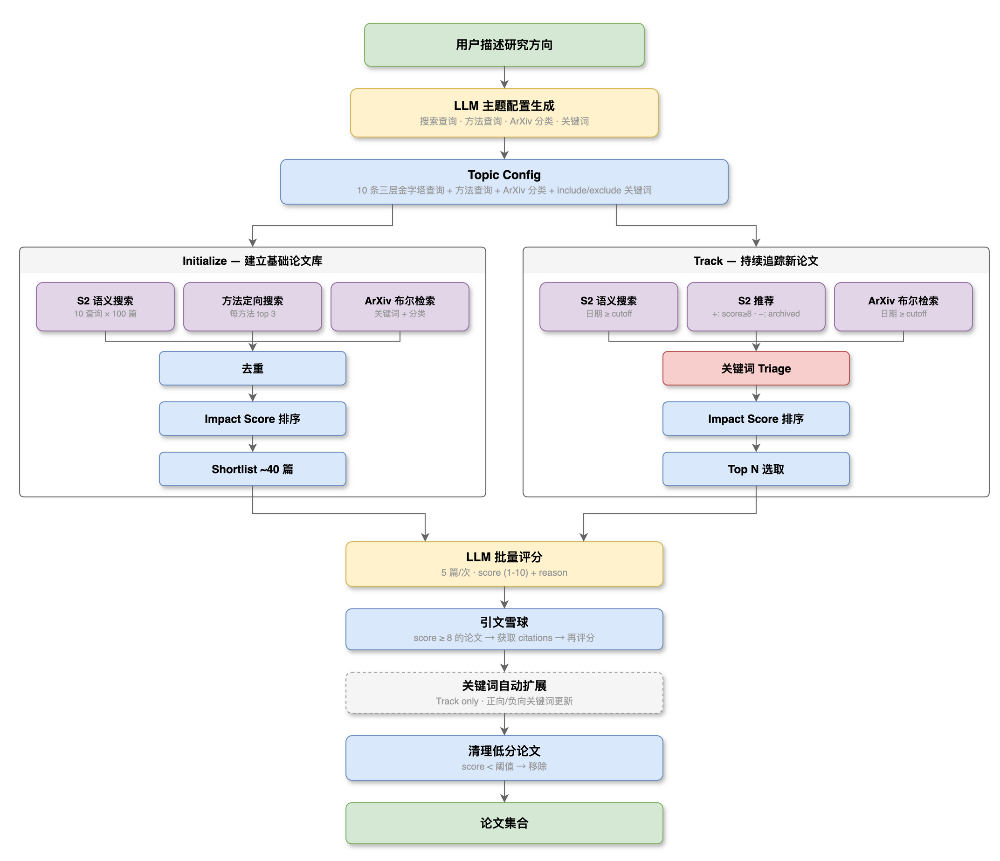

# PaperPilot

[中文](README.md) | English

AI-powered ArXiv paper screening system — describe a research direction, automatically collect high-impact foundational papers, continuously track newly published high-value papers, and generate structured research digests.

## Features

- **AI-Driven Topic Generation** — Describe your research interest in one sentence, LLM automatically generates 3-tier pyramid search queries, ArXiv categories, and method keywords
- **Multi-Source Paper Discovery** — Semantic Scholar semantic search + ArXiv boolean search + citation snowballing + method-specific search
- **Two-Stage Screening** — Impact Score metadata pre-filtering (citations + influence + survey/top-venue bonus) → LLM batch scoring
- **Smart Recommendations** — S2 Recommendations API with high-scored papers as positive signals + archived papers as negative signals
- **Highlights Homepage** — Displays high-value papers with LLM score ≥ 7 across all topics by default
- **Continuous Tracking** — Scheduled automatic tracking of new papers (weekly by default), automatic keyword expansion, auto-generated research digests
- **Deep Paper Analysis** — Fetches full paper content, LLM generates structured analysis reports
- **Customizable Prompts** — Built-in prompt templates can be customized in the Settings page, including scoring criteria modification
- **Multi-Language Output** — Supports output language switching: 中文/English/日本語/한국어/Français/Español and more
- **Research Digests** — Three types of LLM-driven structured reports: field overview, weekly digest, monthly report
- **Email Delivery** — Optional SMTP email delivery for digests, supports SSL/STARTTLS
- **Cost Control** — Tiered scoring strategy, LLM only used for shortlist, target < 30 RMB/month
- **Dark/Light Theme** — Modern UI with theme switching

## Quick Start

### Requirements

- Python >= 3.11
- Node.js >= 18
- Docker (optional, for containerized deployment)

### Local Development

```bash
# Backend
uv sync                                    # or pip install -r requirements.txt
uvicorn src.main:app --reload --port 8000

# Frontend
cd frontend && npm install && npm run dev
```

Open http://localhost:3000 → go to **Settings** to configure your LLM API Key, then you're ready to go.

### Docker Deployment

```bash
cp .env.example .env                       # optional: pre-fill API keys, or configure via WebUI after startup
docker-compose up -d --build
```

Open http://localhost:3000 → complete configuration in the Settings page.

Two containers: backend (Python + SQLite) + frontend (Nginx). SQLite data is persisted via Docker volume.

## Configuration

All settings can be managed in the **Settings** page of the WebUI:

- **LLM** — API Key, Base URL, Model (any OpenAI-compatible API: Alibaba Cloud Bailian, OpenAI, DeepSeek, etc.)
- **Semantic Scholar** — API Key (optional; without it you may hit rate limits. [Get your key here](https://www.semanticscholar.org/product/api#api-key-form))
- **Email** — SMTP configuration (optional)
- **Pipeline** — Scoring thresholds, batch size, budget cap, etc.
- **Prompts** — Output language, scoring criteria, digest templates
- **Schedule** — Cron expressions for track/weekly/monthly jobs

> You can also pre-configure via `.env` file or environment variables. See [.env.example](.env.example). Priority: Settings page > `.env` > defaults.

## Pipeline



**Initialize** builds a foundational paper library from scratch: LLM generates topic config → S2 semantic search + method-specific search + ArXiv boolean search → deduplication → Impact Score ranking → Shortlist Top-N → LLM batch scoring → citation snowballing (score ≥ 8) → remove low-scored papers

**Track** continuously tracks new papers: S2 semantic search (date filtered) + S2 recommendations (positive/negative signals) + ArXiv boolean search → keyword triage → Impact Score → Top N → LLM scoring → citation snowballing → automatic keyword expansion → remove low-scored papers

> Default cleanup thresholds: Initialize removes papers with score < 6, Track removes papers with score < 7. Adjustable in the Settings page.

### Scheduling

- **Track**: Every Sunday at 00:00 (Asia/Shanghai), adjustable in Settings
- **Weekly Digest**: Every Monday at 09:00 (Asia/Shanghai)
- **Monthly Report**: 1st of each month at 10:00 (Asia/Shanghai)

## Architecture

**Tech Stack**: Python 3.11 / FastAPI / SQLAlchemy / SQLite(WAL) + React 18 / Vite 5 / Tailwind CSS v4

**LLM**: Any OpenAI-compatible API (developed and tested with Qwen3.5-Plus via Alibaba Cloud Bailian), httpx + tenacity retry (3 attempts, exponential backoff 2-30s, timeout 300s)

**Prompt System** — 6 structured prompt templates (customizable in Settings), with fixed input/output JSON schemas:

| Prompt | Purpose | Output |
|--------|---------|--------|
| `batch_scoring.md` | Batch paper scoring | `{scores: [{index, score, reason}]}` |
| `draft_generation.md` | Topic config generation | `{name, categories, keywords, search_queries, method_queries}` |
| `field_overview.md` | Field overview | `{summary, pillars[], reading_path{}, open_problems[]}` |
| `weekly_digest.md` | Weekly digest | `{week_summary, must_read[], worth_noting[], trend_signal}` |
| `monthly_report.md` | Monthly report | `{month_summary, highlights[], clusters[], momentum{}}` |
| `paper_analysis.md` | Deep paper analysis | Structured analysis report (methods, contributions, limitations, etc.) |

**Configuration**: `app_settings` table (key-value), priority: DB > `.env` > hardcoded defaults. Managed through the Settings page.

## Project Structure

```
src/
  main.py              # FastAPI entrypoint + lifespan + router registration
  config.py            # Pydantic Settings (SQLite + LLM + SMTP)
  database.py          # SQLAlchemy + SQLite (WAL)
  models/              # ORM: Paper, RuleSet, Run, PaperRuleSet, TokenUsage, Digest, EmailLog
  schemas/             # Pydantic request/response models
  routers/             # API routes
    rulesets.py          # Topic CRUD + runs + papers
    papers.py            # Global papers (highlighted filter)
    digests.py           # Digest CRUD + generation + email delivery
    stats.py             # Cost statistics (costs, daily, requests)
    rules.py             # ArXiv category list
    health.py            # Health check
    app_settings.py      # App settings + email test
  services/            # Business logic
    llm_client.py        # OpenAI-compatible LLM client + tenacity retry
    draft_generator.py   # AI topic config generation (3-tier pyramid queries)
    batch_scorer.py      # Batch LLM scoring
    digest_generator.py  # Field overview / weekly digest / monthly report generation
    email_service.py     # SMTP email delivery + structured HTML templates
    impact_scoring.py    # S2 metadata impact score
    pipeline.py          # Initialize + Track orchestration
    semantic_scholar.py  # Semantic Scholar API (search + recommendations + citations)
    arxiv.py             # ArXiv API boolean search
    paper_analyzer.py    # Deep paper analysis (full-text fetch + LLM analysis)
    scheduler.py         # APScheduler scheduled tasks
    app_settings.py      # App settings read/write (DB-first)
  prompts/             # 6 Markdown prompt templates
frontend/
  src/
    pages/               # Papers, RuleSetWizard, RuleSetDashboard, CostStats, AppSettings
    components/          # Layout (sidebar, theme toggle, LLM Loading Banner)
    contexts/            # ThemeContext (dark/light)
    api/                 # Axios API layer (client, rulesets, stats)
  e2e/                   # Playwright E2E tests
```

## Testing

```bash
# Backend tests (60 tests, excluding 2 known hanging tests)
.venv/bin/pytest -k "not (test_create_run or test_list_runs)"

# E2E tests
cd frontend && npx playwright test

# Frontend build
cd frontend && npm run build
```

## License

MIT
